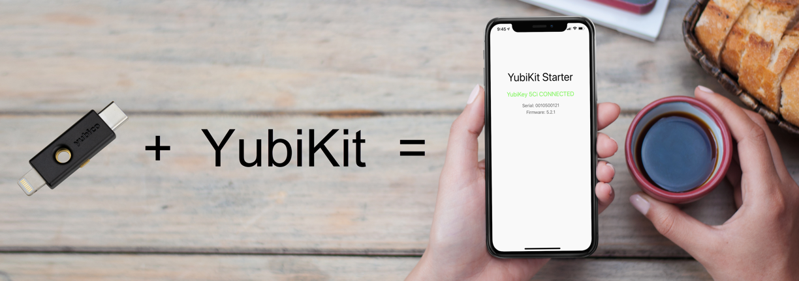
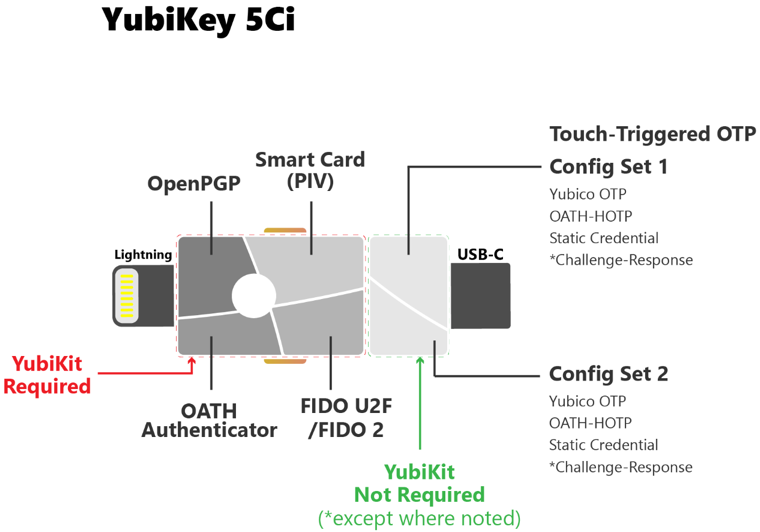
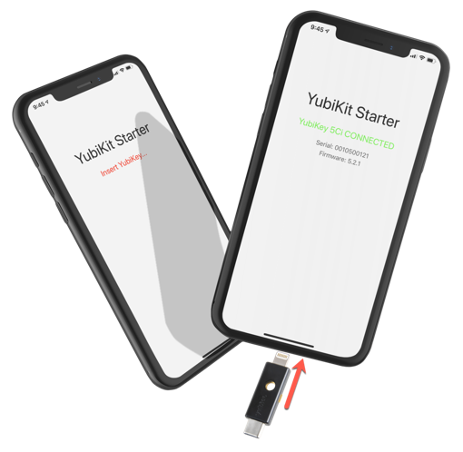
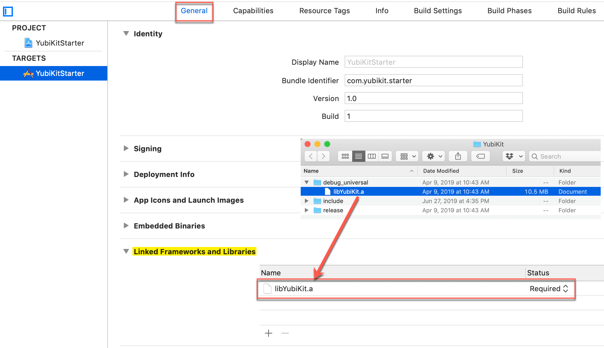
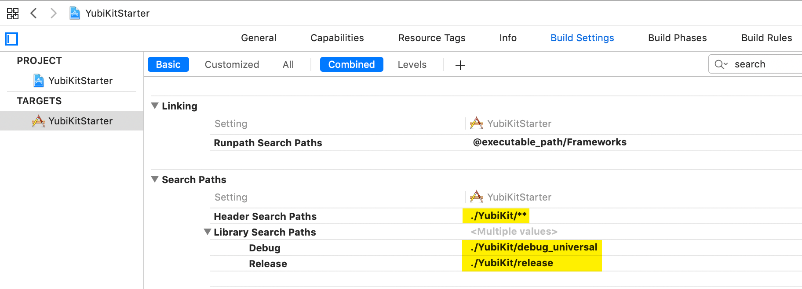
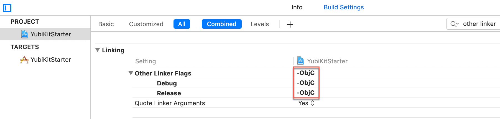
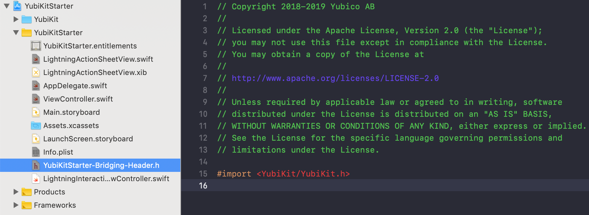
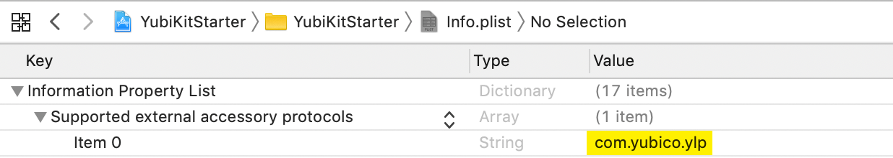
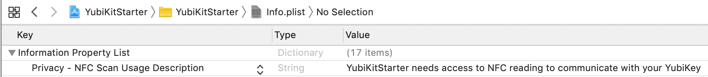
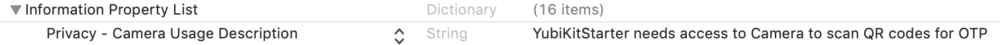

[]()

## [About](#about)

`YubiKit Starter` is a single view iOS Swift **Swift 5.0**+ app with the [Yubico Mobile iOS SDK (YubiKit)](https://github.com/Yubico/yubikit-ios) already integrated. This starter is intended to be used as a baseline for integrating strong two factor authentication for mobile apps using the YubiKey 5Ci hardware key over the Apple Lightning® port.

> **About the Yubico Mobile iOS SDK**: The Yubico Mobile iOS SDK or **YubiKit** provides the interface between your iOS app and the YubiKey connected to the Lightning port. The YubiKey 5Ci is an MFi accessory and the YubiKit communicates with the key over iAP2 (iPod Accessory Protocol) when the key is connected to the Lightning port of a physical device.

> **Is the YubiKit required?** You don't need to include the YubiKit into your app to interact with the YubiKey 5Ci connected to the Lightning port if you are only implementing `Yubico OTP`, `static passwords`, or `custom slot 1 or 2 configuration` as the YubiKey 5Ci acts as a HID keyboard (and not an MFi accessory) in these scenarios and will simply type out the codes to screen when the key (YubiKey 5Ci) is touched.



## [Quick Start](#quickstart)

1. Clone this repo from Mac Terminal
```git
 $ git clone https://github.com/yubicolabs/YubiKit-iOS-Starter.git
```
2. Launch the project in Xcode (11+) 
```git
 $ cd YubiKit-iOS-Starter
 $ open YubiKitStarter.xcodeproj
```
3. Build and Run the Starter App on a real device


> **What does the YubiKit Starter app do?**
The **YubiKit Starter** app keeps track of the state of the YubiKey (connected or not connected) and displays information about the inserted key such as key `name`, `serial #`, and `firmware version`. 



Congratulations! You now have the `YubiKit Starter` app running and interacting with a YubiKey 5Ci via the Lightning port using very basic functions. You can now add features such as OTP, U2F, WebAuthn, or other features available via the YubiKey 5Ci to this starter app. If you already have an app and wish to integrate the YubiKit manually, follow the instructions below. Good luck and let us know if you have any questions or feedback by submitting a Github issue. Thanks!

---

## [Add the YubiKit iOS SDK manually - To your own app](#manual)
This section is intended for developers that want to start with their own iOS app and add  the YubiKit manually.

<details><summary><strong>Step-by-step instructions for adding YubiKit SDK for iOS to your app</strong></summary><p>

## [Add the YubiKit SDK for iOS to an existing app](#addyubikitsdk)
YubiKit SDK is currently available through a static framework and can be added to any new or existing iOS Xcode project.

**[Download YubiKit SDK for iOS (zip file)]**

1. [Download](https://github.com/Yubico/yubikit-ios/releases/download/2.0.0/YubiKit_2_0_0.zip) the YubiKit SDK for iOS (.zip) to your desktop.

2. Unzip YubiKit_2_0_0.zip

**[Add YubiKit folder to your Xcode project]**

3. Drag the entire `/YubiKit_2_0_0/YubiKit` folder to your YubiKitStarter Xcode project. Check the option *Copy items if needed*. 

**[Linked Frameworks and Libraries]**

4. `Project Settings` > `General` > `Linked Frameworks and Libraries`.
Click + and select Add Other. Locate the ``libYubiKit.a`` in YubiKit/debug_universal folder and add it.


**[Library Search Paths]**

5. ``Build Settings`` > Filter by 'Library Search Paths', expand to show debug & release.
Set Release to ``YubiKit/release`` folder and
Set Debug to ``YubiKit/debug_universal`` folder.


**[Header Search Paths]**

6. ``Build Settings`` > Filter by 'Header Search Path'. Set both Debug & Release to ``./YubiKit/**`` (recursive)

**[-ObjC flag]**

7. Add -ObjC flag
``Build Settings`` > Filter by 'Other Linker Flags'. Add the ``-ObjC`` flag to Debug and Release


8. **Add a Bridging-Header**

    You can add a Bridging Header manually or have Xcode do it for you. Here's how to add and configure Xcode to use the bridging header. A  bit of trickery here...
    1. Right Click in the project explorer and choose new file
    2. Selected *Objective-C File*
    3. Name it DELETE_ME or something obvious as we'll go back and delete it
    4. When prompted to have a bridging file created, **select yes**
    5. Delete the file you created (DELETE_ME.m)
    6. Add `#import <YubiKit/YubiKit.h>` to your bridging header
    

Let's build the project!

**[Enable Lightning Protocol]**
> The YubiKey 5Ci is an Apple MFi external accessory and communicates over iAP2. You are telling your app that all communication with the 5Ci as a supported external accessory is via `com.yubico.ylp`.


Open info.plist and add `com.yubico.ylp` as a new item under `Supported external accessory protocols`


**[Grant accesss to NFC]**


Optional: if you are planning to use an NFC enabled YubiKey
Open info.plist and add the following usage:
'Privacy - NFC Scan Usage Description' - "This application needs access to NFC"


**[Grant accesss to CAMERA]**


Optional: if you are planning to use the camera to read QR codes for OTP
Open info.plist and add the following usage:
'Privacy - Camera Usage Description' - "This application needs access to Camera for reading QR codes."


</p>
</details>

## [License](#license)

YubiKit Starter is provided under the [Apache License 2.0](https://github.com/dmennis/YubiKit-iOS-Starter/blob/master/LICENSE).